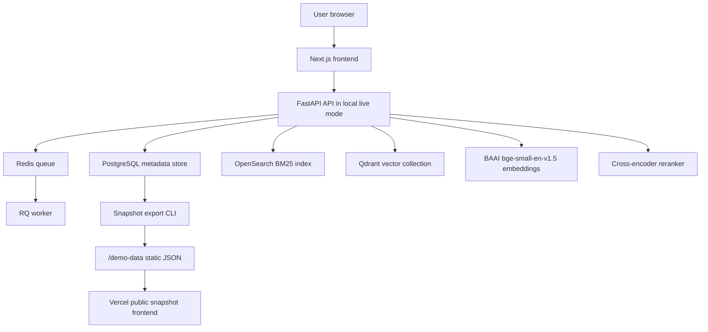
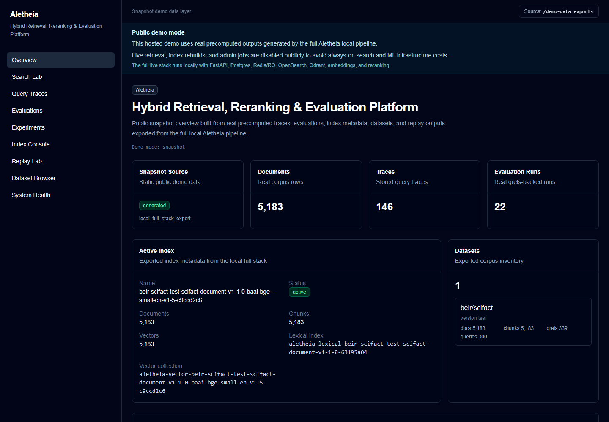
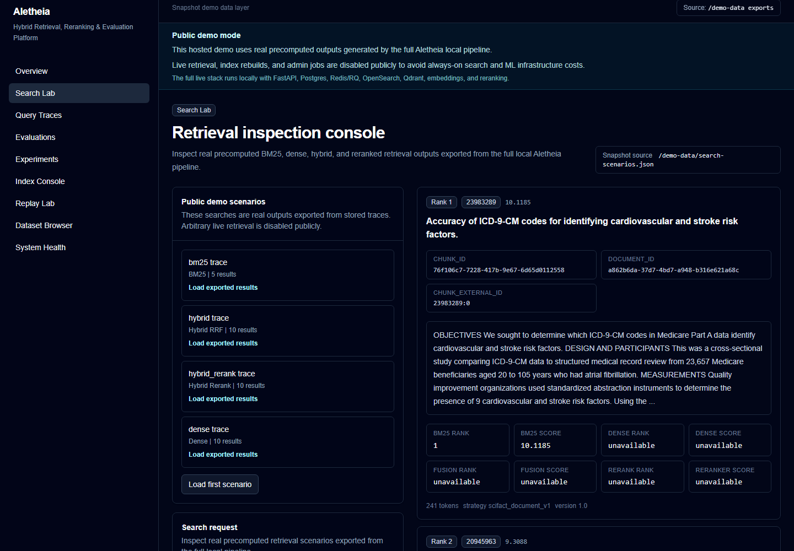
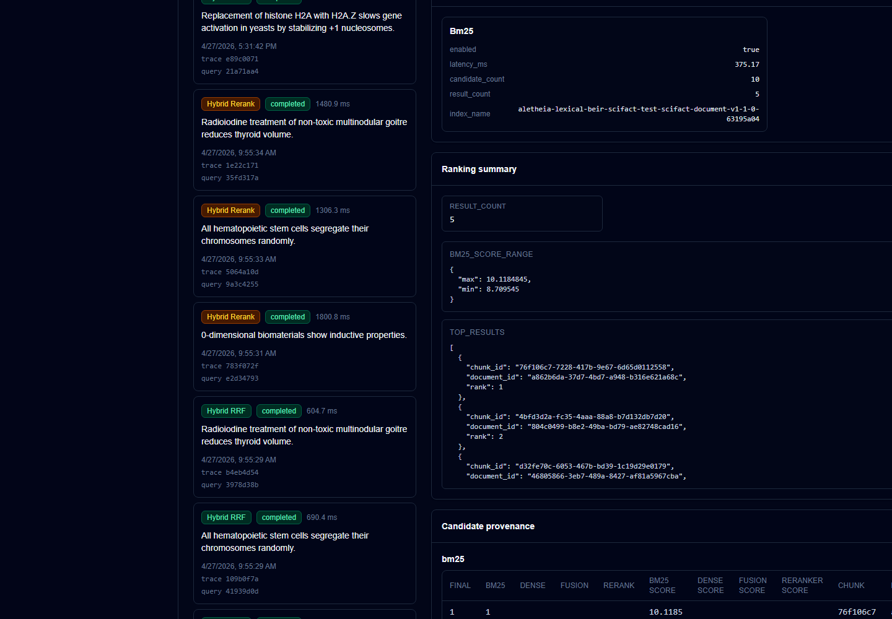
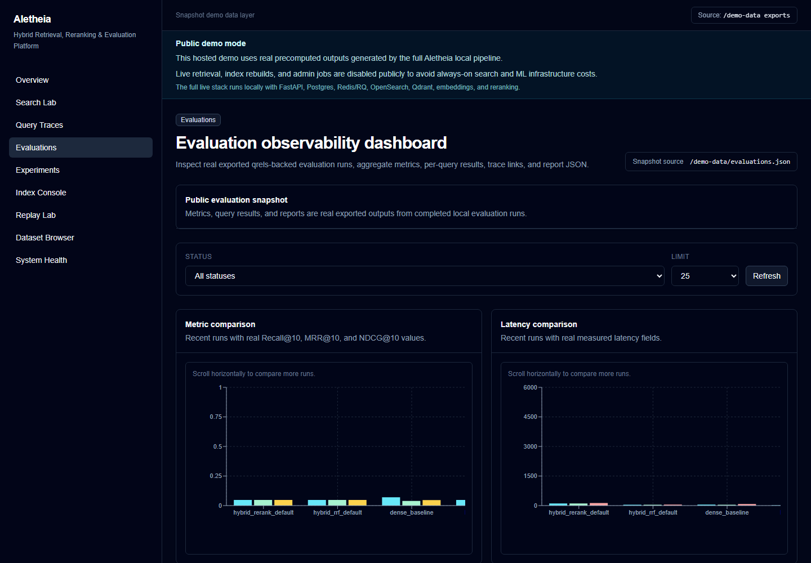
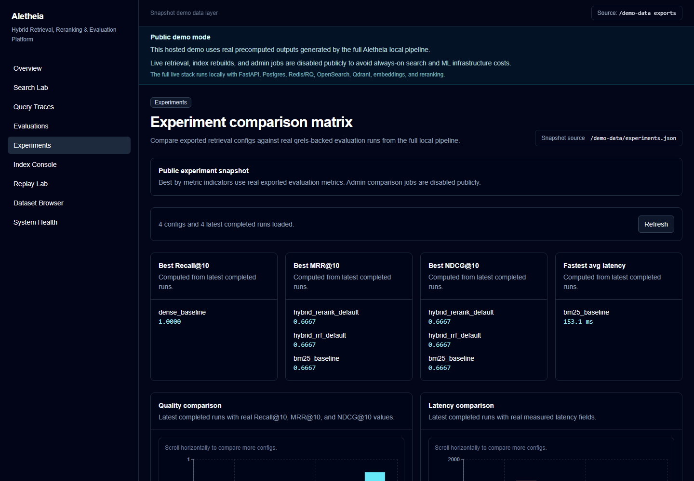
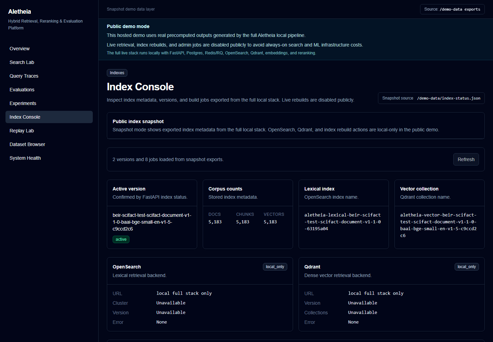

# Aletheia

Hybrid Retrieval, Reranking & Evaluation Platform

[](https://github.com/YuvrajKashyap/aletheia/actions/workflows/ci.yml)

Aletheia is a production-style search and ranking platform for comparing BM25, dense retrieval, hybrid retrieval, and cross-encoder reranking over a real benchmark corpus. It focuses on retrieval quality, query tracing, evaluation, index observability, and experiment comparison. It is not a chatbot or a RAG wrapper.

- Public demo: https://aletheia.yuvrajkashyap.com
- Technical docs: [docs/docs-index.md](docs/docs-index.md)
- Architecture diagrams: [docs/diagrams/README.md](docs/diagrams/README.md)

## What This Demonstrates

- Backend search infrastructure with FastAPI, PostgreSQL, Redis/RQ, OpenSearch, and Qdrant.
- ML systems integration using local embedding and reranking models.
- Lexical and vector indexing with explicit index versions and activation state.
- Async job orchestration for indexing, evaluation, experiments, and replay workflows.
- Evaluation correctness for document-level qrels over chunk-level retrieval results.
- Query tracing, candidate provenance, rank movement, system events, and worker heartbeats.
- A serious dashboard frontend for search, traces, evaluations, experiments, indexes, datasets, replay, and system health.
- Deployment-aware public demo strategy that avoids pretending expensive live infrastructure is always running.

## What Aletheia Is Not

Aletheia is not a chatbot, answer generator, thin RAG wrapper, fake dashboard, or public hosted live search cluster. It does not claim production traffic, production scale, or public live arbitrary retrieval. It is retrieval, ranking, evaluation, and search observability infrastructure built around real SciFact data and real retrieval outputs.

## Public Demo Mode

The hosted demo runs in public snapshot mode. It serves real traces, evaluations, index metadata, replay results, and dataset samples exported from the full local Docker-based Aletheia stack. Live arbitrary retrieval, reranking, index rebuilds, evaluation jobs, replay jobs, and admin actions are intentionally disabled on the public site to avoid always-on OpenSearch, Qdrant, Redis, worker, and ML model hosting costs.

The full live stack runs locally through Docker Compose and local Python/Node processes. Snapshot data is regenerated from real local outputs, not hand-written. The public site is therefore cost-aware and honest: it is interactive over real exported artifacts, but it does not claim to run public live arbitrary search.

## Architecture

Aletheia has two operating shapes:

- Local live stack: the full system with FastAPI, PostgreSQL, Redis/RQ, OpenSearch, Qdrant, local embedding and reranking models, and the Next.js frontend.
- Public snapshot demo: Vercel serves the Next.js frontend and static `/demo-data` JSON exported from the full local stack. Neon holds the migrated hosted schema, but the public demo does not run the live backend/search/worker stack.



More detail:

- [Local live architecture](docs/diagrams/local-live-architecture.md)
- [Public snapshot architecture](docs/diagrams/public-snapshot-architecture.md)
- [Deployment topology](docs/diagrams/deployment-topology.md)
- [Architecture doc](docs/architecture.md)

## Core Features

Search and retrieval:

- BM25 lexical retrieval through OpenSearch.
- Dense vector retrieval through Qdrant.
- Hybrid retrieval using Reciprocal Rank Fusion.
- Hybrid plus cross-encoder reranking over top-N candidates.

Indexing:

- OpenSearch lexical indexes.
- Qdrant vector collections.
- Explicit index versions, activation, rollback, and job status.
- Index metadata and operational history exposed in the UI.

Evaluation:

- BEIR SciFact corpus, benchmark queries, and qrels.
- Recall@5, Recall@10, MRR@10, NDCG@10, and latency metrics.
- Chunk hits mapped back to parent document IDs before scoring.
- Offline and async evaluation runners.
- Experiment configs, comparison matrix, and evaluation reports.

Observability:

- Query traces with retrieval stage details.
- Candidate scores, ranks, and provenance.
- Rank movement and comparison panels.
- System events, worker heartbeats, and queue/model status.

Frontend:

- Search Lab
- Query Traces
- Evaluation Dashboard
- Experiment Matrix
- Index Console
- Dataset Browser
- Replay Lab
- System Health

## Benchmark Results

These results are from the Step 47 benchmark suite over BEIR SciFact. Full rows use all 300 benchmark queries. The hybrid rerank row is sampled and is not directly comparable to the full 300-query rows.

| Mode | Scope | Queries | Failed | Recall@5 | Recall@10 | MRR@10 | NDCG@10 | Avg ms | P95 ms | Notes |
| --- | --- | ---: | ---: | ---: | ---: | ---: | ---: | ---: | ---: | --- |
| bm25 | Full | 300 | 0 | 0.7187 | 0.7707 | 0.6296 | 0.6574 | 54.8 | 84.2 | Full 300-query SciFact benchmark. |
| dense | Full | 300 | 0 | 0.7624 | 0.8386 | 0.6705 | 0.7077 | 1144.5 | 1057.6 | Full 300-query SciFact benchmark using BAAI/bge-small-en-v1.5. |
| hybrid | Full | 300 | 0 | 0.7558 | 0.8429 | 0.6698 | 0.7055 | 856.6 | 949.8 | Full 300-query SciFact benchmark using Reciprocal Rank Fusion. |
| hybrid_rerank | Sampled | 50 | 0 | 0.7633 | 0.7933 | 0.6733 | 0.6969 | 3265.9 | 3399.4 | Sampled rerank benchmark. Not directly comparable to full 300-query runs. |

Methodology notes:

- Dataset: BEIR SciFact.
- Qrels are document-level.
- Aletheia retrieves chunks and maps hits back to parent document IDs before scoring.
- Latency is from local execution and includes local model/runtime behavior.
- No benchmark metrics are fabricated or hand-entered outside generated benchmark output.

Interpretation:

- Hybrid RRF achieved the strongest full-run Recall@10.
- Dense improved recall over BM25 but was slower due local embedding model calls.
- BM25 remained fastest.
- Hybrid rerank was sampled because CPU cross-encoder reranking is expensive.
- The sampled rerank row is not directly comparable to full 300-query rows.

See [docs/benchmark-results.md](docs/benchmark-results.md) for methodology and reproduction notes.

## Tech Stack

| Area | Stack |
| --- | --- |
| Frontend | Next.js, TypeScript, Tailwind CSS, Recharts |
| Backend | FastAPI, Pydantic, SQLAlchemy, Alembic |
| Infrastructure | PostgreSQL, Redis/RQ, OpenSearch, Qdrant, Docker Compose |
| ML | BAAI/bge-small-en-v1.5, cross-encoder/ms-marco-MiniLM-L-6-v2 |
| Deployment and demo | Vercel, Neon schema, static snapshot JSON |
| Testing and quality | pytest, Ruff, GitHub Actions, PowerShell scripts |

## Local Setup

Prerequisites:

- Windows 11 or equivalent
- Docker Desktop
- Python 3.11
- Node 22
- Git

Clone the repo:

```powershell
git clone https://github.com/YuvrajKashyap/aletheia.git
cd aletheia
```

Start local infrastructure:

```powershell
powershell -ExecutionPolicy Bypass -File scripts/powershell/dev.ps1
```

Set up the backend:

```powershell
py -3.11 -m venv services/api/.venv
.\services\api\.venv\Scripts\python.exe -m pip install --upgrade pip
.\services\api\.venv\Scripts\python.exe -m pip install -e "services/api[dev]"
```

Run migrations:

```powershell
powershell -ExecutionPolicy Bypass -File scripts/powershell/db-upgrade.ps1
```

Load SciFact and create chunks:

```powershell
powershell -ExecutionPolicy Bypass -File scripts/powershell/ingest-scifact.ps1
powershell -ExecutionPolicy Bypass -File scripts/powershell/chunk-documents.ps1
```

Build indexes:

```powershell
powershell -ExecutionPolicy Bypass -File scripts/powershell/build-lexical-index.ps1 -Active -Recreate
powershell -ExecutionPolicy Bypass -File scripts/powershell/build-vector-index.ps1 -Active -Recreate -BatchSize 64
```

Start the API:

```powershell
powershell -ExecutionPolicy Bypass -File scripts/powershell/api.ps1
```

Start the worker:

```powershell
powershell -ExecutionPolicy Bypass -File scripts/powershell/worker.ps1
```

Start the web app:

```powershell
powershell -ExecutionPolicy Bypass -File scripts/powershell/web.ps1
```

Full first-time setup can take time because SciFact data, indexes, embeddings, and local model caches are built locally.

## Public Snapshot Regeneration

Export the public demo snapshot from real local outputs:

```powershell
powershell -ExecutionPolicy Bypass -File scripts/powershell/export-demo-snapshot.ps1
```

Snapshot files are written under:

```text
apps/web/public/demo-data
```

Vercel should use:

```text
NEXT_PUBLIC_DEMO_MODE=snapshot
```

Snapshot JSON should be regenerated from the full local pipeline. It should not be hand-edited to create better-looking results.

## Quality Gates

Run the fast local CI gate:

```powershell
powershell -ExecutionPolicy Bypass -File scripts/powershell/ci-check.ps1
```

Run the production readiness check:

```powershell
powershell -ExecutionPolicy Bypass -File scripts/powershell/production-build-check.ps1
```

GitHub Actions CI runs:

- backend tests
- Ruff
- frontend typecheck
- frontend lint
- frontend snapshot build
- doctor

Full benchmark and evaluation jobs do not run in default GitHub CI because they require local search and ML infrastructure.

## Documentation

- [Docs index](docs/docs-index.md)
- [Architecture](docs/architecture.md)
- [Retrieval design](docs/retrieval-design.md)
- [Evaluation methodology](docs/evaluation.md)
- [Tradeoffs](docs/tradeoffs.md)
- [Interview notes](docs/interview-notes.md)
- [Public demo mode](docs/public-demo-mode.md)
- [Benchmark results](docs/benchmark-results.md)
- [Architecture diagrams](docs/diagrams/README.md)

## Screenshots

The hosted demo runs in public snapshot mode using real outputs exported from the full local Aletheia pipeline.













See the full screenshot set in [docs/screenshots.md](docs/screenshots.md).

## Limitations

- The public demo is snapshot-backed, not live arbitrary hosted retrieval.
- The full retrieval stack currently runs locally.
- The hybrid rerank benchmark is sampled.
- Local CPU model latency is higher than optimized hosted inference would be.
- SciFact is small compared to web-scale search.
- Auth, multi-tenant controls, and production admin roles are not implemented yet.
- Atlas integration is future-facing and not implemented in this repo.

## Future Work

- Atlas integration as a web corpus ingestion source.
- Optional hosted live backend and worker stack.
- Larger benchmark datasets.
- Stronger caching and performance optimization.
- Auth and admin roles.
- Managed OpenSearch and Qdrant deployment option.
- More evaluation and report dashboards.
- Model warmup and persistent worker tuning.
- Additional retrieval corpora.
