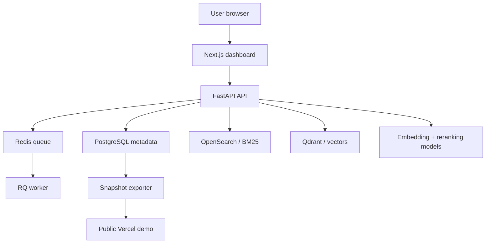

# Aletheia

**Hybrid retrieval, reranking, evaluation, and search observability—built as infrastructure, not a chatbot wrapper.**

[](https://github.com/YuvrajKashyap/aletheia/actions/workflows/ci.yml)
[](https://aletheia.yuvrajkashyap.com)
[](LICENSE)

[**Explore the public demo**](https://aletheia.yuvrajkashyap.com) · [Architecture](docs/architecture.md) · [Benchmark methodology](docs/benchmark-results.md) · [Documentation](docs/docs-index.md)


Aletheia is a production-style search platform for comparing and debugging **BM25**, **dense vector retrieval**, **hybrid Reciprocal Rank Fusion**, and **cross-encoder reranking** over the BEIR SciFact benchmark. It makes retrieval behavior inspectable through query traces, candidate provenance, evaluation reports, experiment comparison, versioned indexes, replay workflows, and system-health views.

The complete live stack runs locally with FastAPI, PostgreSQL, Redis/RQ, OpenSearch, Qdrant, and local embedding and reranking models. The hosted demo uses real snapshots exported from that stack so the project remains publicly explorable without pretending expensive search infrastructure is always running.

## Engineering highlights

- Built lexical and vector retrieval pipelines with OpenSearch and Qdrant, then combined results through Reciprocal Rank Fusion and cross-encoder reranking.
- Evaluated retrieval on **5,183 SciFact documents**, **300 benchmark queries**, and **339 qrels**, mapping chunk-level hits back to parent documents before scoring.
- Added versioned indexes, explicit activation and rollback state, background jobs, worker heartbeats, system events, and failure-visible operational views.
- Captured trace-level rank, score, latency, and provenance across every retrieval stage so search behavior can be compared and debugged.
- Built a Next.js dashboard spanning Search Lab, Query Traces, Evaluations, Experiments, Index Console, Dataset Browser, Replay Lab, and System Health.
- Shipped reproducible migrations, local orchestration scripts, automated tests, CI, architecture documentation, and a cost-aware public demo.

## Benchmark results

The full benchmark rows cover all 300 SciFact queries. The hybrid-rerank result is a 50-query sample because local CPU cross-encoder inference is substantially more expensive; it is intentionally not presented as directly comparable to the full runs.

| Mode | Scope | Recall@5 | Recall@10 | MRR@10 | NDCG@10 | Avg latency |
| --- | --- | ---: | ---: | ---: | ---: | ---: |
| BM25 | 300 queries | 0.7187 | 0.7707 | 0.6296 | 0.6574 | 54.8 ms |
| Dense | 300 queries | 0.7624 | 0.8386 | 0.6705 | 0.7077 | 1144.5 ms |
| Hybrid RRF | 300 queries | 0.7558 | **0.8429** | 0.6698 | 0.7055 | 856.6 ms |
| Hybrid + rerank | 50-query sample | 0.7633 | 0.7933 | 0.6733 | 0.6969 | 3265.9 ms |

**Takeaway:** hybrid RRF produced the strongest full-run Recall@10, dense retrieval improved recall over BM25 at a substantial local latency cost, and BM25 remained the fastest system.

Results were generated from the retrieval pipeline rather than hand-authored for presentation. See [benchmark results](docs/benchmark-results.md) and [evaluation methodology](docs/evaluation.md) for reproduction details and caveats.

## Architecture



Aletheia has two deliberately separate operating shapes:

- **Local live stack:** arbitrary search, reranking, indexing, evaluation, replay, and administration run against the complete Docker-based system.
- **Public snapshot demo:** the Next.js interface serves real traces, evaluations, index metadata, replay results, and dataset samples exported from the full stack. Mutating and compute-heavy actions are disabled.

This boundary keeps the demo honest and affordable while preserving a reproducible live implementation.

Detailed diagrams:

- [Local live architecture](docs/diagrams/local-live-architecture.md)
- [Public snapshot architecture](docs/diagrams/public-snapshot-architecture.md)
- [Deployment topology](docs/diagrams/deployment-topology.md)

## Product surfaces

| Surface | Purpose |
| --- | --- |
| Search Lab | Compare retrieval modes and inspect ranked results |
| Query Traces | Follow candidates, scores, ranks, and latency across stages |
| Evaluation Dashboard | Review Recall, MRR, NDCG, failures, and benchmark runs |
| Experiment Matrix | Compare retrieval configurations and evaluation outcomes |
| Index Console | Inspect versions, activation state, jobs, and operational history |
| Dataset Browser | Explore benchmark documents, queries, and relevance judgments |
| Replay Lab | Re-run saved query scenarios against selected configurations |
| System Health | Monitor queues, workers, models, events, and dependencies |

## Screenshots

| Search Lab | Query Trace |
| --- | --- |
|  |  |

| Evaluation Dashboard | Experiment Matrix |
| --- | --- |
|  |  |

See the [complete screenshot set](docs/screenshots.md).

## Tech stack

| Layer | Technologies |
| --- | --- |
| Frontend | Next.js, TypeScript, Tailwind CSS, Recharts |
| API and data | FastAPI, Pydantic, SQLAlchemy, Alembic, PostgreSQL |
| Search | OpenSearch, Qdrant, Reciprocal Rank Fusion |
| Jobs and operations | Redis, RQ, worker heartbeats, system events |
| ML | BAAI/bge-small-en-v1.5, cross-encoder/ms-marco-MiniLM-L-6-v2 |
| Infrastructure | Docker Compose, Vercel, Neon, snapshot export tooling |
| Quality | pytest, Ruff, TypeScript, ESLint, GitHub Actions |

## Key technical decisions

### Document-level evaluation over chunk retrieval

SciFact relevance judgments are document-level, while Aletheia retrieves chunks. Evaluation maps chunk hits to parent document IDs and deduplicates them before calculating Recall@K, MRR@10, and NDCG@10. This prevents inflated metrics caused by repeatedly retrieving chunks from the same relevant document.

### Traceable hybrid ranking

Hybrid search is not exposed as an opaque final list. A trace records lexical and dense candidates, fusion inputs, score and rank changes, reranker movement, and stage latency. The dashboard makes it possible to explain why a document appeared and where its rank changed.

### Versioned operational state

Indexes are treated as managed assets with versions, activation state, rollback behavior, job history, and failure visibility—not as invisible setup steps. The UI and API expose enough state to diagnose mismatched or unhealthy retrieval infrastructure.

### Honest public deployment

The public demo does not claim to provide always-on arbitrary retrieval. It presents genuine exported outputs from the full local stack and visibly disables operations that require the backend, workers, search engines, or local models.

## Local development

### Prerequisites

- Docker Desktop
- Python 3.11
- Node.js 22
- Git
- PowerShell scripts are provided for the primary Windows development path

Clone the repository:

```powershell
git clone https://github.com/YuvrajKashyap/aletheia.git
cd aletheia
```

Start infrastructure:

```powershell
powershell -ExecutionPolicy Bypass -File scripts/powershell/dev.ps1
```

Set up the API and database:

```powershell
py -3.11 -m venv services/api/.venv
.\services\api\.venv\Scripts\python.exe -m pip install --upgrade pip
.\services\api\.venv\Scripts\python.exe -m pip install -e "services/api[dev]"
powershell -ExecutionPolicy Bypass -File scripts/powershell/db-upgrade.ps1
```

Load SciFact and build indexes:

```powershell
powershell -ExecutionPolicy Bypass -File scripts/powershell/ingest-scifact.ps1
powershell -ExecutionPolicy Bypass -File scripts/powershell/chunk-documents.ps1
powershell -ExecutionPolicy Bypass -File scripts/powershell/build-lexical-index.ps1 -Active -Recreate
powershell -ExecutionPolicy Bypass -File scripts/powershell/build-vector-index.ps1 -Active -Recreate -BatchSize 64
```

Run the API, worker, and web app in separate terminals:

```powershell
powershell -ExecutionPolicy Bypass -File scripts/powershell/api.ps1
powershell -ExecutionPolicy Bypass -File scripts/powershell/worker.ps1
powershell -ExecutionPolicy Bypass -File scripts/powershell/web.ps1
```

The first setup can take time because the corpus, indexes, embeddings, and local model caches are built locally. See the [documentation index](docs/docs-index.md) for the complete runbook.

## Verification

Run the local CI gate:

```powershell
powershell -ExecutionPolicy Bypass -File scripts/powershell/ci-check.ps1
```

Run the production-readiness check:

```powershell
powershell -ExecutionPolicy Bypass -File scripts/powershell/production-build-check.ps1
```

GitHub Actions verifies backend tests, Ruff, frontend typechecking, linting, snapshot builds, and doctor checks. Full search and benchmark workloads remain local because they require the complete infrastructure and ML runtime.

## Current limitations

- The hosted demo is snapshot-backed rather than a live arbitrary-search cluster.
- The full retrieval stack currently runs locally.
- The hybrid-rerank benchmark is sampled.
- Local CPU inference is not representative of optimized hosted-model latency.
- SciFact is much smaller than a web-scale corpus.
- Authentication, multi-tenant controls, and production administration are not implemented.
- Atlas integration is planned but not yet implemented.

## Documentation

- [Architecture](docs/architecture.md)
- [Retrieval design](docs/retrieval-design.md)
- [Evaluation methodology](docs/evaluation.md)
- [Benchmark results](docs/benchmark-results.md)
- [Engineering tradeoffs](docs/tradeoffs.md)
- [System design walkthrough](docs/system-design-walkthrough.md)
- [Interview Q&A](docs/interview-q-and-a.md)
- [Full documentation index](docs/docs-index.md)

## License

Aletheia is available under the [MIT License](LICENSE).
