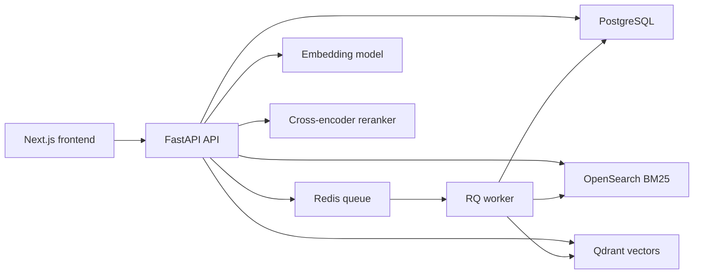
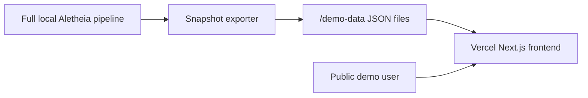

# Architecture

Aletheia is a production-style retrieval, reranking, evaluation, and search observability platform. The local system runs a full FastAPI-backed retrieval stack over BEIR SciFact, while the public Vercel demo serves real exported outputs from that local pipeline in snapshot mode.

Related diagrams:

- [Local Live Architecture](diagrams/local-live-architecture.md)
- [Public Snapshot Architecture](diagrams/public-snapshot-architecture.md)
- [Deployment Topology](diagrams/deployment-topology.md)

## System Components

- **Next.js frontend**: dashboard and control surface for search, traces, evaluations, experiments, indexes, datasets, replay, and system health.
- **FastAPI API**: owns backend logic, retrieval orchestration, evaluation, replay, indexing, and admin-protected operations.
- **PostgreSQL**: metadata store for datasets, documents, chunks, indexes, queries, traces, evaluations, experiments, replay runs, jobs, and system events.
- **SQLAlchemy and Alembic**: ORM and schema migration layer.
- **Redis/RQ**: async job queue and worker runtime for expensive operations.
- **OpenSearch**: BM25 lexical indexing and retrieval.
- **Qdrant**: dense vector indexing and retrieval.
- **Embedding model**: `BAAI/bge-small-en-v1.5`.
- **Reranker model**: `cross-encoder/ms-marco-MiniLM-L-6-v2`.
- **Docker Compose**: local service orchestration for Postgres, Redis, OpenSearch, and Qdrant.
- **Vercel snapshot demo**: hosted frontend using static JSON exported from the real local system.
- **Neon hosted schema**: hosted Postgres schema foundation, not the live public retrieval backend.

## Local Architecture

## Public Snapshot Architecture

The public demo does not run live arbitrary backend search. It uses real traces, evaluations, index metadata, dataset samples, replay outputs, and system state exported from the local full stack.

## Request And Data Flow

### Ingestion

SciFact data is loaded into PostgreSQL as datasets, documents, benchmark queries, and relevance judgments. These records are the source of truth for evaluation.

### Chunking

Documents are chunked through backend-owned logic. The current SciFact strategy is document-level chunking, producing 5,183 chunks for 5,183 documents.

### Indexing

Index versions track lifecycle state and index metadata. Lexical builds write to OpenSearch. Vector builds create embeddings and write points to Qdrant. Active index changes are explicit.

### Search

FastAPI receives search requests, resolves the active or requested index version, runs the selected retrieval mode, stores trace data, and returns ranked retrieval results. Supported modes are `bm25`, `dense`, `hybrid`, and `hybrid_rerank`.

### Query Tracing

Search traces store retrieval inputs, stage outputs, candidates, scores, ranks, and timing details. This makes ranking behavior inspectable after each query.

### Evaluation

The evaluation runner executes real benchmark queries, maps retrieved chunks back to parent documents, deduplicates documents, compares against qrels, stores query-level results, and writes JSON reports.

### Replay

Saved queries and golden queries can be replayed through retrieval modes or experiment configurations. Replay focuses on trace-level debugging and comparing reruns over time.

### Public Snapshot Export

The exporter reads real local database outputs and writes static JSON files for the hosted demo. Snapshot mode is read-only and disables live retrieval, index rebuilds, evaluation jobs, replay jobs, and admin actions.

## Local vs Hosted

### Local Full Live Stack

Local development can run FastAPI, Postgres, Redis/RQ, OpenSearch, Qdrant, embeddings, reranking, indexing, evaluation, replay, and the Next.js frontend.

### Public Snapshot Demo

The public demo is a cost-aware hosted frontend. It serves real exported data from `/demo-data` and does not require always-on OpenSearch, Qdrant, Redis, workers, or ML model hosting.

## Intentionally Not Hosted Live

- OpenSearch
- Qdrant
- Redis/RQ worker
- Embedding model
- Reranker model
- Arbitrary live backend search
- Expensive admin actions

Snapshot mode is an intentional architecture choice: real outputs, low hosting cost, honest limitations, and no fake data.
