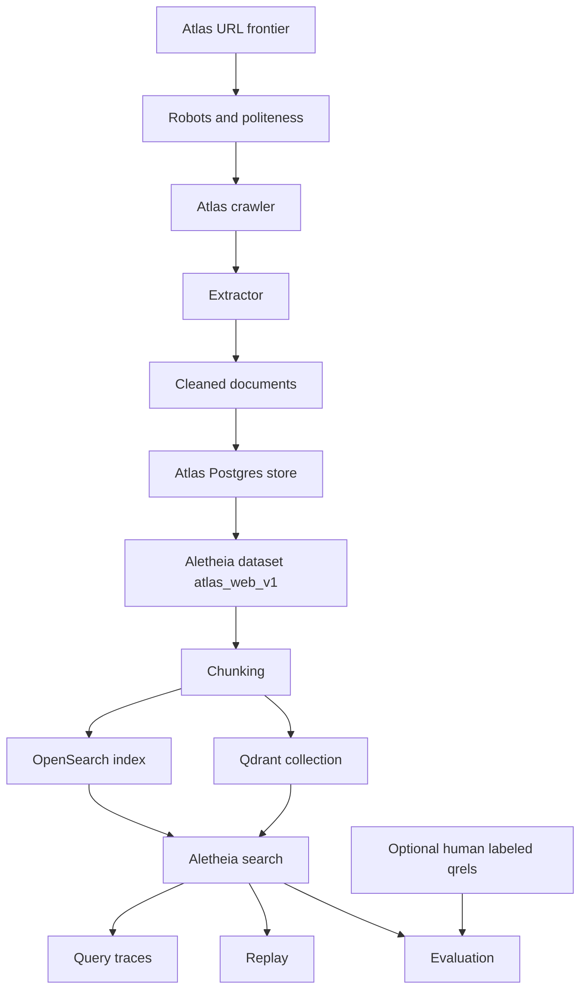

# Atlas Integration Flow

This diagram shows a future integration where Atlas produces a web corpus and Aletheia provides retrieval, ranking, evaluation, and observability.

## Notes

- This integration is future-facing and not implemented yet.
- Atlas produces the corpus.
- Aletheia provides retrieval, ranking, evaluation, replay, and search observability.
