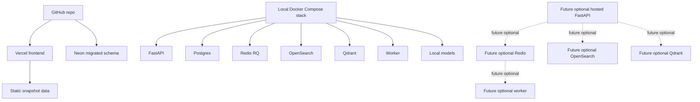

# Deployment Topology

This diagram shows current public hosting, local full-stack operation, and future optional hosted components.

## Notes

- Current public demo is snapshot-hosted.
- Future live backend hosting is optional and cost-dependent.
- Future optional components are not currently deployed.
- Secrets must stay out of the repository.
