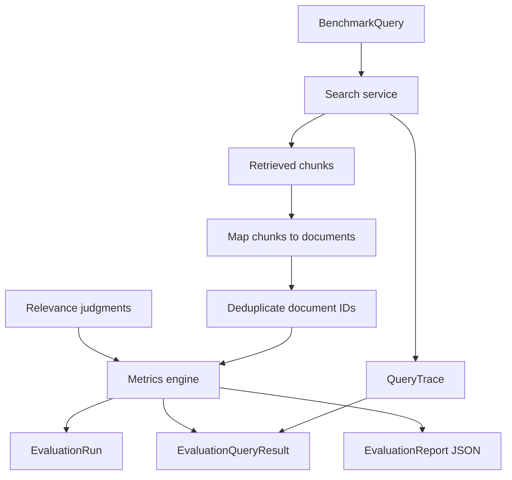

# Evaluation Flow

This diagram shows qrels-backed evaluation from benchmark query to stored report.

## Notes

- Metrics are document-level because SciFact qrels are document-level.
- Qrels are not invented.
- Zero metric values are valid when retrieval misses relevant documents.
