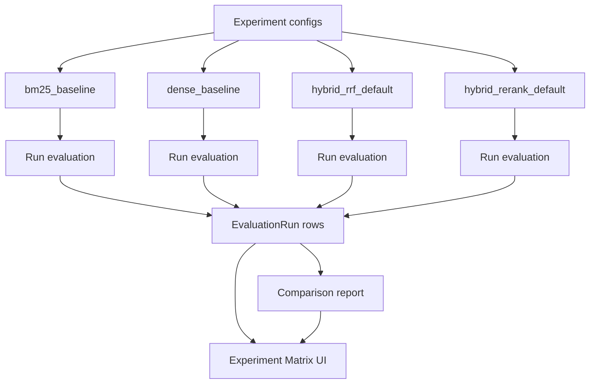

# Experiment Comparison Flow

This diagram shows how experiment configs connect to evaluation runs and the Experiment Matrix UI.

## Notes

- Best-by-metric indicators are computed from real evaluation runs.
- Aletheia does not hardcode winners.
- Missing metrics remain unavailable.
