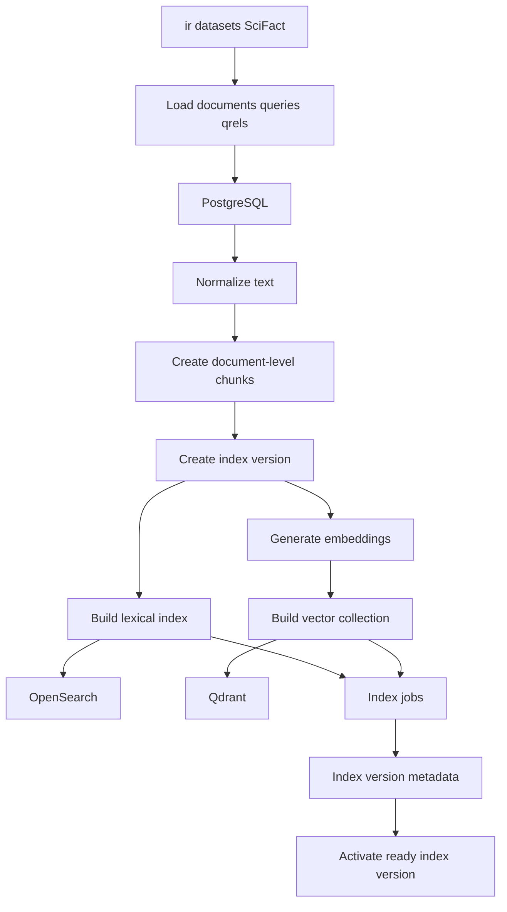

# Ingestion And Indexing Flow

This diagram shows how SciFact data becomes versioned lexical and vector indexes.

## Notes

- SciFact uses document-level chunks because qrels are document-level.
- Limited index builds must not corrupt corpus-level metadata.
- Failed jobs and failed index versions are tracked.
