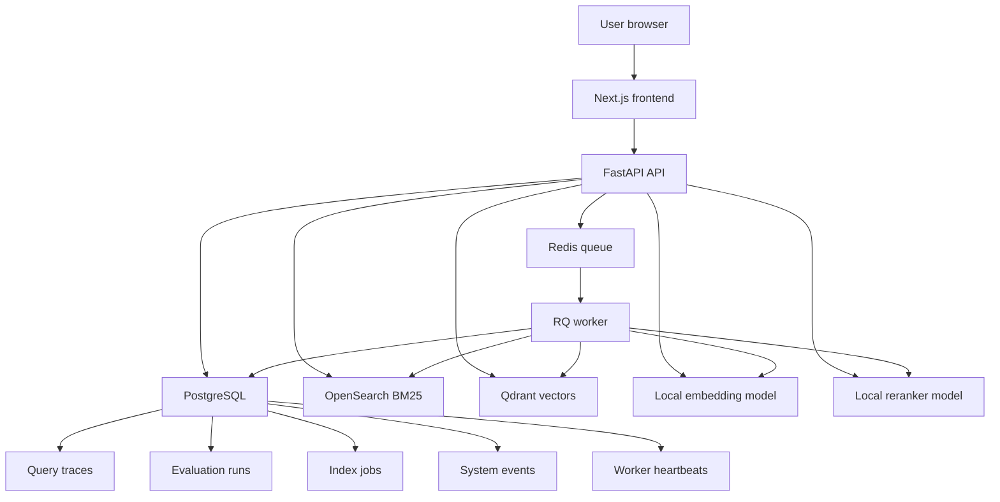

# Local Live Architecture

This diagram shows the full local Aletheia stack used for live retrieval, indexing, evaluation, replay, tracing, and snapshot export.

## Notes

- This is the full live local stack.
- Services run through Docker Compose and local processes.
- This stack generates the real outputs used by public snapshot exports.
- This full stack is not currently hosted publicly.
