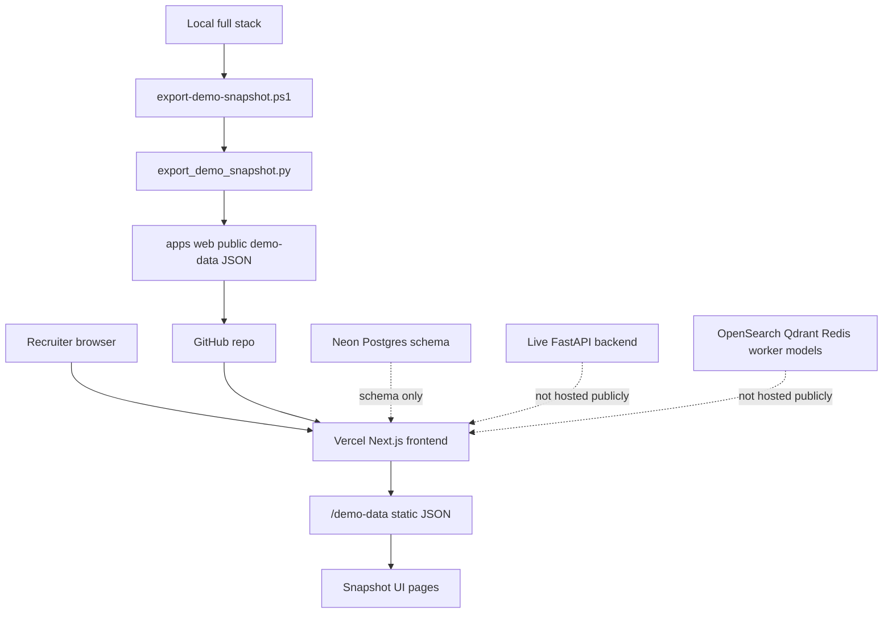

# Public Snapshot Architecture

This diagram shows how the public demo serves real exported data without hosting the full live search stack.

## Notes

- The public demo uses real exported outputs.
- Live retrieval and admin jobs are disabled publicly.
- This is a cost-aware architecture, not fake data.
- The public demo does not run live arbitrary search.
