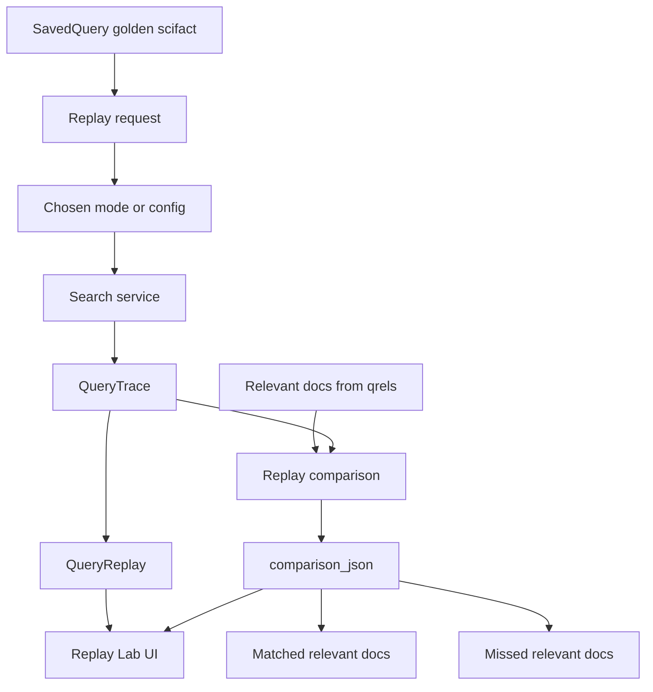

# Replay Flow

This diagram shows saved query replay as trace-level debugging and regression support.

## Notes

- Replay is trace-level debugging and regression support.
- Replay is not the same as a full evaluation run.
- Golden queries come from real SciFact qrels.
