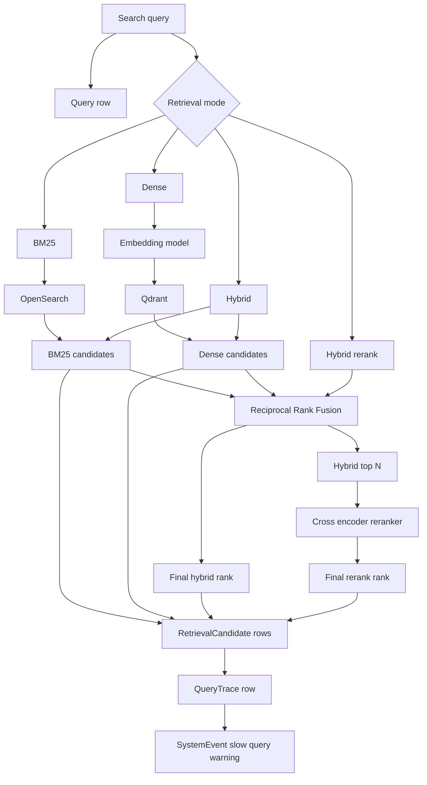

# Search Flow

This diagram shows the four retrieval modes and the records produced for observability.

## Notes

- RRF uses rank positions, not raw score mixing.
- The reranker only scores top-N candidates.
- Aletheia does not generate answers and does not provide chatbot behavior.
