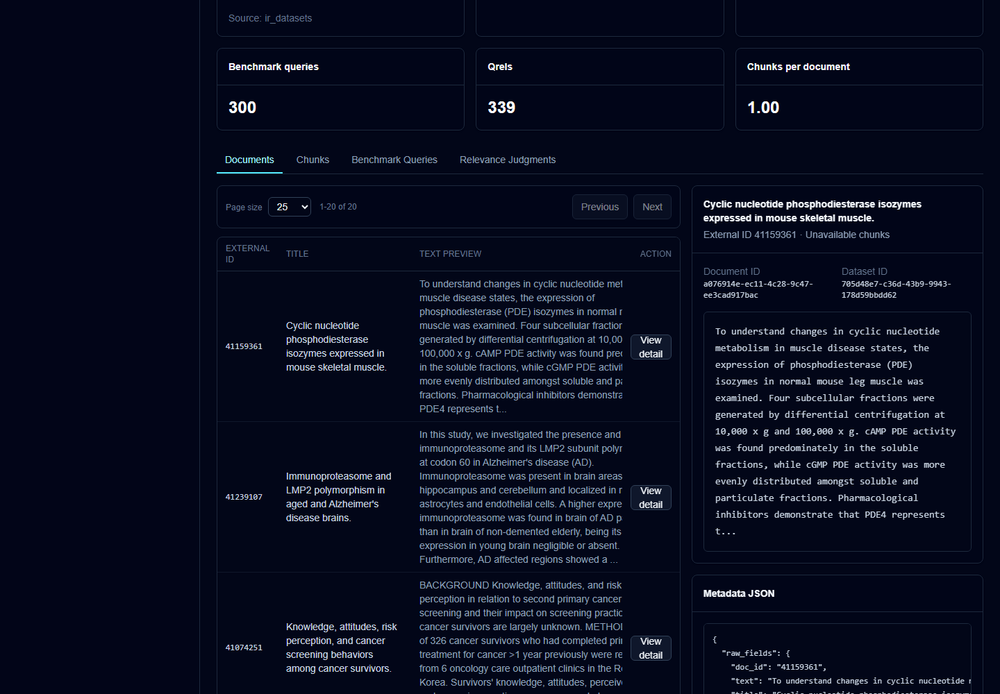
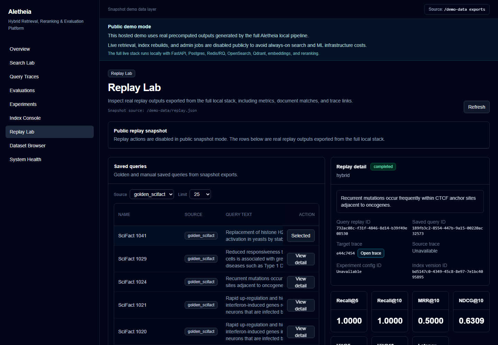
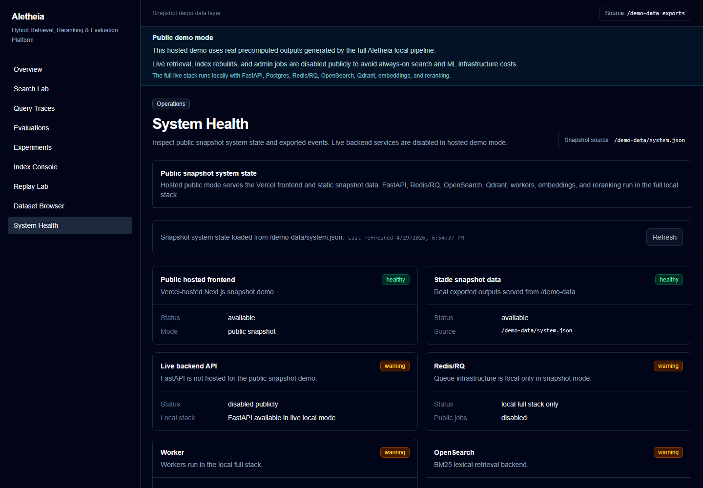

# Screenshot Guide

These screenshots are captured from real public snapshot demo pages. They are not mocked, generated, or edited to fake data.

## Overview

- File: `docs/assets/screenshots/overview.png`
- Source: https://aletheia.yuvrajkashyap.com
- Mode: Public snapshot
- Shows: snapshot banner, product summary, exported counts, active index metadata, and dataset overview.

## Search Lab

- File: `docs/assets/screenshots/search-lab.png`
- Source: https://aletheia.yuvrajkashyap.com/search
- Mode: Public snapshot
- Shows: curated snapshot scenarios, a real exported retrieval result, score breakdown, and result metadata.

## Query Trace

- File: `docs/assets/screenshots/query-trace.png`
- Source: https://aletheia.yuvrajkashyap.com/traces
- Mode: Public snapshot
- Shows: selected hybrid or reranked trace details, stage metadata, ranking summary, and candidate provenance.

## Evaluation Dashboard

- File: `docs/assets/screenshots/evaluation-dashboard.png`
- Source: https://aletheia.yuvrajkashyap.com/evaluations
- Mode: Public snapshot
- Shows: exported qrels-backed evaluation dashboard with metric and latency charts.

## Experiment Matrix

- File: `docs/assets/screenshots/experiment-matrix.png`
- Source: https://aletheia.yuvrajkashyap.com/experiments
- Mode: Public snapshot
- Shows: exported experiment configs, best-by-metric cards, and comparison charts.

## Index Console

- File: `docs/assets/screenshots/index-console.png`
- Source: https://aletheia.yuvrajkashyap.com/indexes
- Mode: Public snapshot
- Shows: active index metadata, corpus counts, lexical index name, vector collection name, and local-only service state.

## Dataset Browser

- File: `docs/assets/screenshots/dataset-browser.png`
- Source: https://aletheia.yuvrajkashyap.com/datasets
- Mode: Public snapshot
- Shows: real SciFact stats, exported document sample rows, and a document detail panel.

## Replay Lab

- File: `docs/assets/screenshots/replay-lab.png`
- Source: https://aletheia.yuvrajkashyap.com/replay
- Mode: Public snapshot
- Shows: saved golden queries, replay detail, real replay metrics, and trace link affordance.

## System Health

- File: `docs/assets/screenshots/system-health.png`
- Source: https://aletheia.yuvrajkashyap.com/system
- Mode: Public snapshot
- Shows: honest public snapshot state, available static data, disabled public backend, and local-only infrastructure.

## Policy

- Do not add fake screenshots.
- Do not create placeholder PNG, JPG, or WebP files.
- Refresh screenshots only from real public snapshot pages or real local live states.
- Do not capture private browser tabs, secrets, tokens, or personal account data.
- If a route is broken, report the issue rather than fabricating a screenshot.
- Public snapshot screenshots must not imply public live arbitrary retrieval.

## Updating Screenshots

1. Open the target route in the public snapshot demo or a verified local live environment.
2. Confirm the page uses real exported data or real local backend data.
3. Capture a PNG under `docs/assets/screenshots/`.
4. Verify the image is not empty, does not show a browser error page, and does not expose private information.
5. Update this catalog and README image links only for files that actually exist.

## Video Walkthrough Assets

- Demo walkthrough script: [docs/demo-walkthrough.md](demo-walkthrough.md)
- Recording checklist: [docs/demo-recording-guide.md](demo-recording-guide.md)

Screenshots are captured and committed. Video recording is a separate manual step. No video file exists yet.
